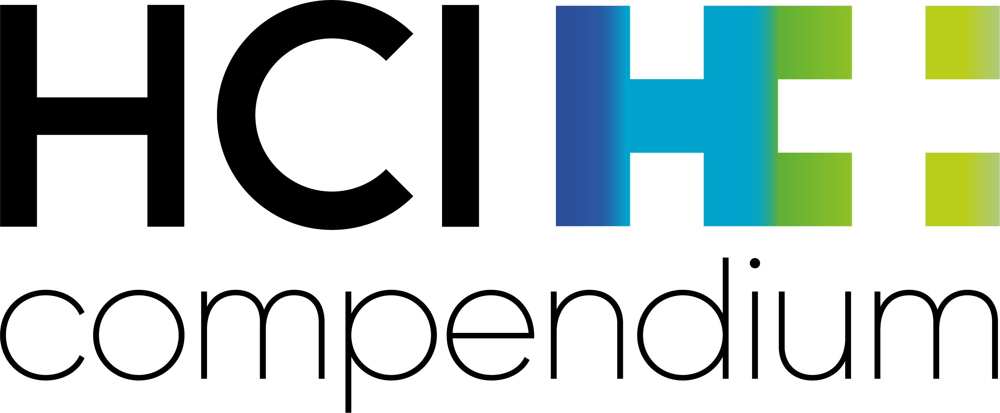

Index de l'ensemble des outils référencés dans PHARE.

## Référentiels du médicament

<div class="index-grid">

<a href="https://base-donnees-publique.medicaments.gouv.fr/" target="_blank" rel="noopener noreferrer"
   class="index-card" data-book="outils/referentiels.html#bdpm">
  
  <span>BDPM</span>
  <small class="card-label">-</small>
</a>

<a href="https://www.drugs.com/" target="_blank" rel="noopener noreferrer"
   class="index-card" data-book="outils/referentiels.html#drugs">
  
  <span>Drugs.com</span>
  <small class="card-label">-</small>
</a>

<a href="https://www.theriaque.org/" target="_blank" rel="noopener noreferrer"
   class="index-card" data-book="outils/referentiels.html#theriaque">
  
  <span>Theriaque</span>
  <small class="card-label">-</small>
</a>

<a href="https://www.vidal.fr/" target="_blank" rel="noopener noreferrer"
   class="index-card" data-book="outils/referentiels.html#vidal">
  
  <span>Vidal</span>
  <small class="card-label">-</small>
</a>

<a href="https://www.pharmacomedicale.org/" target="_blank" rel="noopener noreferrer"
   class="index-card" data-book="outils/referentiels.html#pharmacomedicale-cnpm">
  
  <span>Pharmacomedicale</span>
  <small class="card-label">Pharmacologie</small>
</a>

</div>


## Interactions médicamenteuses

<div class="index-grid">

<a href="https://drug-interactions.medicine.iu.edu/main-table" target="_blank" rel="noopener noreferrer"
   class="index-card" data-book="outils/interactions.html#clinicalph">
  
  <span>Clin. Pharm. SoM</span>
  <small class="card-label">Cytochromes</small>
</a>

<a href="https://www.ddi-predictor.org/" target="_blank" rel="noopener noreferrer"
   class="index-card" data-book="outils/interactions.html#ddi-predictor">
  
  <span>DDI Predictor</span>
  <small class="card-label">Cytochromes</small>
</a>

<a href="https://insilico-cyp.charite.de/SuperCYPsPred/" target="_blank" rel="noopener noreferrer"
   class="index-card" data-book="outils/interactions.html#supercypspred">
  
  <span>SuperCYPsPred</span>
  <small class="card-label">Cytochromes</small>
</a>

<a href="https://ansm.sante.fr/documents/reference/thesaurus-des-interactions-medicamenteuses-1" target="_blank" rel="noopener noreferrer"
   class="index-card" data-book="outils/interactions.html#thésaurus-ansm">
  
  <span>Thésaurus ANSM</span>
  <small class="card-label">-</small>
</a>

<a href="https://www.drugs.com/drug_interactions.html" target="_blank" rel="noopener noreferrer"
   class="index-card" data-book="outils/interactions.html#drugs">
  
  <span>Drugs.com</span>
  <small class="card-label">-</small>
</a>

<a href="https://www.covid19-druginteractions.org/" target="_blank" rel="noopener noreferrer"
   class="index-card" data-book="outils/interactions.html#covid-drug-interactions">
  
  <span>COVID</span>
  <small class="card-label">Infectiologie</small>
</a>

<a href="https://www.hep-druginteractions.org/" target="_blank" rel="noopener noreferrer"
   class="index-card" data-book="outils/interactions.html#hep-drug-interactions">
  
  <span>HEP</span>
  <small class="card-label">Infectiologie</small>
</a>

<a href="https://www.hiv-druginteractions.org/" target="_blank" rel="noopener noreferrer"
   class="index-card" data-book="outils/interactions.html#hiv-drug-interactions">
  
  <span>HIV</span>
  <small class="card-label">Infectiologie</small>
</a>

<a href="https://sfpt-fr.org/recospaxlovid" target="_blank" rel="noopener noreferrer"
   class="index-card" data-book="outils/interactions.html#recos-paxlovid-sfpt">
  
  <span>Paxlovid</span>
  <small class="card-label">Infectiologie</small>
</a>

<a href="https://www.cancer-druginteractions.org/checker" target="_blank" rel="noopener noreferrer"
   class="index-card" data-book="outils/interactions.html#oncologie">
  
  <span>Cancer</span>
  <small class="card-label">Oncologie</small>
</a>

<a href="https://hedrine.ulb.be/" target="_blank" rel="noopener noreferrer"
   class="index-card" data-book="outils/interactions.html#hedrine">
  
  <span>Hedrine</span>
  <small class="card-label">Phytothérapie</small>
</a>

<a href="https://www.mskcc.org/cancer-care/diagnosis-treatment/symptom-management/integrative-medicine/herbs/search" target="_blank" rel="noopener noreferrer"
   class="index-card" data-book="outils/interactions.html#mskcc-herbs">
  
  <span>MSKCC Herbs</span>
  <small class="card-label">Phytothérapie</small>
</a>

<a href="https://naturalmedicines.therapeuticresearch.com/" target="_blank" rel="noopener noreferrer"
   class="index-card" data-book="outils/interactions.html#natmed">
  
  <span>NatMed</span>
  <small class="card-label">Phytothérapie</small>
</a>

</div>


## Risques iatrogènes

<div class="index-grid">

<a href="https://www.ncbi.nlm.nih.gov/books/NBK501922/" target="_blank" rel="noopener noreferrer"
   class="index-card" data-book="outils/iatrogenie.html#lactmed">
  
  <span>LactMed</span>
  <small class="card-label">Allaitement</small>
</a>

<a href="https://www.e-lactancia.org/" target="_blank" rel="noopener noreferrer"
   class="index-card" data-book="outils/iatrogenie.html#elactancia">
  
  <span>e-lactancia</span>
  <small class="card-label">Allaitement</small>
</a>

<a href="https://www.lecrat.fr/" target="_blank" rel="noopener noreferrer"
   class="index-card" data-book="outils/iatrogenie.html#crat">
  
  <span>CRAT</span>
  <small class="card-label">Grossesse & Allaitement</small>
</a>

<a href="https://www.ncbi.nlm.nih.gov/books/NBK547852/" target="_blank" rel="noopener noreferrer"
   class="index-card" data-book="outils/iatrogenie.html#livertox">
  
  <span>LiverTox</span>
  <small class="card-label">Hépatologie</small>
</a>

<a href="https://www.pneumotox.com/" target="_blank" rel="noopener noreferrer"
   class="index-card" data-book="outils/iatrogenie.html#pneumotox">
  
  <span>Pneumotox</span>
  <small class="card-label">Pneumologie</small>
</a>

<a href="https://www.crediblemeds.org/" target="_blank" rel="noopener noreferrer"
   class="index-card" data-book="outils/iatrogenie.html#credible-meds">
  
  <span>Credible Meds</span>
  <small class="card-label">Allongement QT</small>
</a>

</div>


## Adaptation posologique

<div class="index-grid">

<a href="https://www.rxcirrhose.ca/" target="_blank" rel="noopener noreferrer"
   class="index-card" data-book="outils/adaptation.html#rx-cirrhose">
  
  <span>Rx Cirrhose</span>
  <small class="card-label">Hépatologie</small>
</a>

<a href="https://www.vidal.fr/gpr.html" target="_blank" rel="noopener noreferrer"
   class="index-card" data-book="outils/adaptation.html#gpr">
  
  <span>GPR</span>
  <small class="card-label">Néphrologie</small>
</a>

<a href="https://www.swisspeddose.ch/fr/" target="_blank" rel="noopener noreferrer"
   class="index-card" data-book="outils/adaptation.html#swisspeddose">
  
  <span>SwissPedDose</span>
  <small class="card-label">Pédiatrie</small>
</a>

<a href="https://www.clinpgx.org/" target="_blank" rel="noopener noreferrer"
   class="index-card" data-book="outils/adaptation.html#clinpgx">
  
  <span>ClinPGx</span>
  <small class="card-label">Pharmacogénétique</small>
</a>

<a href="https://www.abxbmi.com/" target="_blank" rel="noopener noreferrer"
   class="index-card" data-book="outils/adaptation.html#abxbmi">
  
  <span>ABXBMI</span>
  <small class="card-label">Poids</small>
</a>

<a href="https://www.adaptobese.com/calculator" target="_blank" rel="noopener noreferrer"
   class="index-card" data-book="outils/adaptation.html#adaptobese">
  
  <span>Adaptobese</span>
  <small class="card-label">Poids</small>
</a>

</div>

## Compatibilité physico-chimique

<div class="index-grid">

<a href="https://www.stabilis.org/" target="_blank" rel="noopener noreferrer"
   class="index-card" data-book="outils/compatibilite.html#stabilis">
  
  <span>Stabilis</span>
</a>

<a href="https://portail.e-harvis.com/" target="_blank" rel="noopener noreferrer"
   class="index-card" data-book="outils/compatibilite.html#drugoptimal">
  
  <span>DruOptimal</span>
</a>

</div>


## Déprescription

<div class="index-grid">

<a href="https://www.pimcheck.org/" target="_blank" rel="noopener noreferrer"
   class="index-card" data-book="outils/deprescription.html#pimcheck">
  
  <span>PIMCheck</span>
</a>

<a href="https://deprescribing.org/" target="_blank" rel="noopener noreferrer"
   class="index-card" data-book="outils/deprescription.html#deprescribing">
  
  <span>Deprescribing</span>
</a>

<a href="https://reseaudeprescription.ca/" target="_blank" rel="noopener noreferrer"
   class="index-card" data-book="outils/deprescription.html#resea">
  
  <span>Réseau Can.</span>
</a>

</div>


## Éducation thérapeutique

<div class="index-grid">

<a href="https://www.onconormandie.fr/" target="_blank" rel="noopener noreferrer"
   class="index-card" data-book="outils/education.html#onconormandie">
  
  <span>OncoNormandie</span>
  <small class="card-label">Oncologie</small>
</a>

<a href="https://splf.fr/videos-zephir/" target="_blank" rel="noopener noreferrer"
   class="index-card" data-book="outils/education.html#zephir-splf">
  
  <span>ZEPHIR</span>
  <small class="card-label">Pneumologie</small>
</a>

</div>


## Formation

<div class="index-grid">

<a href="https://www.euro-pharmat.com/" target="_blank" rel="noopener noreferrer"
   class="index-card" data-book="outils/formation.html#EuroPharmat-splf">
  
  <span>EuroPharmat</span>
  <small class="card-label">Dispositifs Médicaux</small>
</a>

</div>

## Calculs et Conversions

<div class="index-grid">

<a href="https://opioconvert.fr/" target="_blank" rel="noopener noreferrer"
   class="index-card" data-book="outils/calculs.html#opioconvert">
  
  <span>Opioconvert</span>
  <small class="card-label">Antalgie</small>
</a>

<a href="https://www.mdcalc.com/" target="_blank" rel="noopener noreferrer"
   class="index-card" data-book="outils/calculs.html#mdcalc">
  
  <span>MDCalc</span>
  <small class="card-label">Formules & Scores</small>
</a>

<a href="https://www.compendium.ch/" target="_blank" rel="noopener noreferrer"
   class="index-card" data-book="outils/calculs.html#compendiumch">
  
  <span>Compendium CH</span>
  <small class="card-label">RCP Suisse</small>
</a>

<a href="https://www.psychiatrienet.nl/" target="_blank" rel="noopener noreferrer"
   class="index-card" data-book="outils/calculs.html#psychiatrienet">
  
  <span>Psychiatrienet</span>
  <small class="card-label">Psychiatrie</small>
</a>

<a href="https://www.psychopharma.fr/" target="_blank" rel="noopener noreferrer"
   class="index-card" data-book="outils/calculs.html#psychopharma">
  
  <span>Psychopharma</span>
  <small class="card-label">Psychiatrie</small>
</a>

</div>


## Disponibilité et accès aux médicaments

<div class="index-grid">

<a href="https://ansm.sante.fr/documents/reference/referentiel-des-specialites-en-acces-derogatoire" target="_blank" rel="noopener noreferrer"
   class="index-card" data-book="outils/disponibilite.html#accesderogatoires">
  
  <span>Répertoire des accès dérogatoires</span>
</a>

<a href="https://www.meddispar.fr/" target="_blank" rel="noopener noreferrer"
   class="index-card" data-book="outils/disponibilite.html#meddispar">
  
  <span>Meddispar</span>
  <small class="card-label">Dispensation</small>
</a>

<a href="https://www.vigirupture.fr/" target="_blank" rel="noopener noreferrer"
   class="index-card" data-book="outils/disponibilite.html#vigirupture-ansm">
  
  <span>Vigirupture</span>
  <small class="card-label">Ruptures</small>
</a>

</div>


## Autre

<div class="index-grid">

<a href="https://actip.sfpc.eu/home/" target="_blank" rel="noopener noreferrer"
   class="index-card" data-book="outils/autre.html#actip">
  
  <span>ACT IP</span>
</a>

</div>


```{=html}
<script>
document.querySelectorAll('.index-card[data-book]').forEach(card => {
  const bookUrl = card.getAttribute('data-book');

  const btn = document.createElement('a');
  btn.href = bookUrl;
  btn.className = 'int-link';
  btn.title = 'Détails dans PHARE';
  btn.innerHTML = '+';

  btn.addEventListener('click', e => e.stopPropagation());

  card.appendChild(btn);
});
</script>
```