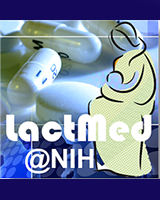
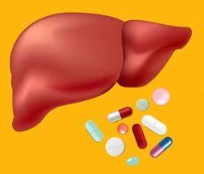
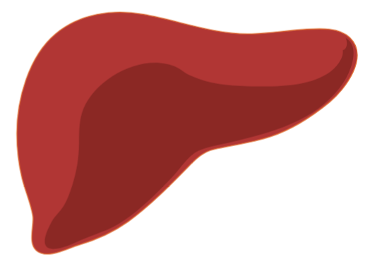
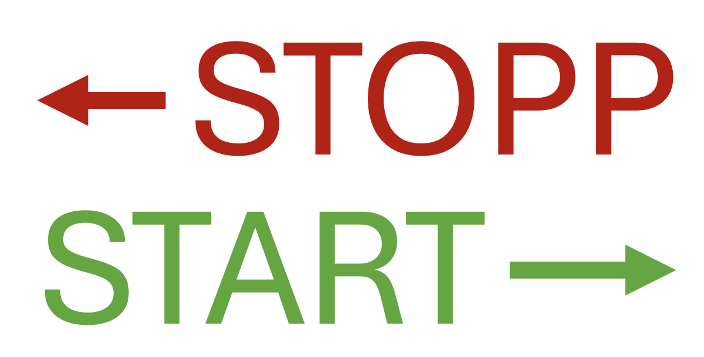
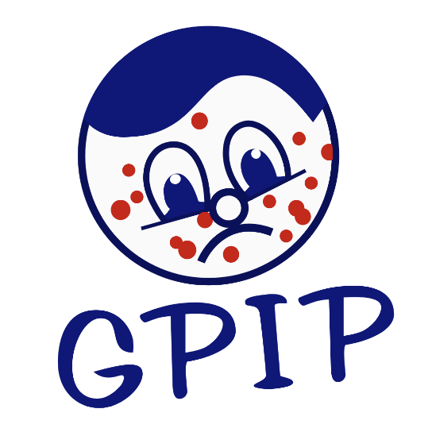
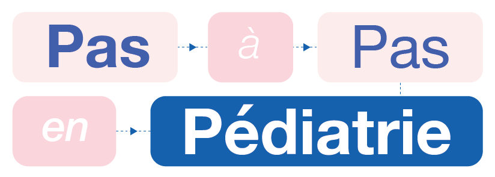
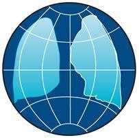
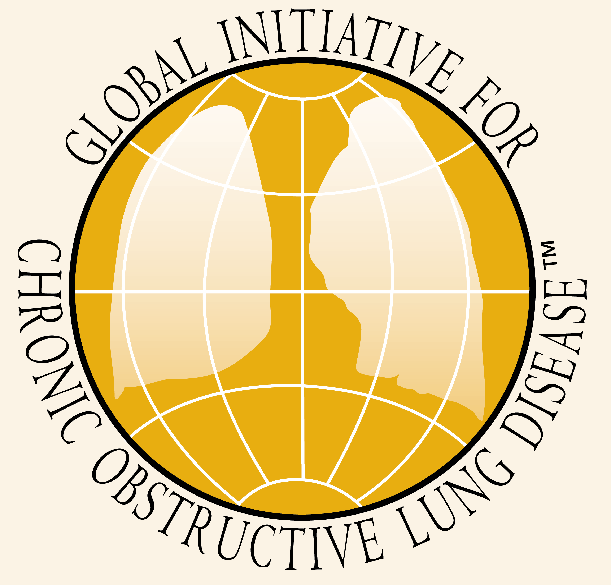

Index catégorisé de l'ensemble des outils référencés dans PHARE.

## Référentiels du médicament

<a href="referentiels.html#bdpm" class="index-card" data-cat="RCP">

BDPM
</a>

<a href="referentiels.html#drugs" class="index-card" data-cat=" ">

Drugs.com
</a>

<a href="referentiels.html#theriaque" class="index-card" data-cat=" ">

Theriaque
</a>

<a href="referentiels.html#vidal" class="index-card" data-cat=" ">

Vidal
</a>

<a href="referentiels.html#pharmacomedicale-cnpm" class="index-card" data-cat="Pharmacologie">

Pharmacomedicale
</a>

## Interactions médicamenteuses

<a href="interactions.html#ddi-predictor" class="index-card" data-cat="Cytochromes">

DDI Predictor
</a>

<a href="interactions.html#supercypspred" class="index-card" data-cat=" ">

SuperCYPsPred
</a>

<a href="interactions.html#thésaurus-ansm" class="index-card" data-cat="Général">

Thésaurus ANSM
</a>

<a href="interactions.html#drugs" class="index-card" data-cat=" ">

Drugs.com
</a>

<a href="interactions.html#covid-drug-interactions" class="index-card" data-cat="Infectiologie">

COVID
</a>

<a href="interactions.html#hep-drug-interactions" class="index-card" data-cat=" ">

HEP
</a>

<a href="interactions.html#hiv-drug-interactions" class="index-card" data-cat=" ">

HIV
</a>

<a href="interactions.html#recos-paxlovid-sfpt" class="index-card" data-cat=" ">

Paxlovid
</a>

<a href="interactions.html#oncologie" class="index-card" data-cat="Oncologie">

Cancer
</a>

<a href="interactions.html#hedrine" class="index-card" data-cat="Phytothérapie">

Hedrine
</a>

<a href="interactions.html#mskcc-herbs" class="index-card" data-cat=" ">

MSKCC Herbs
</a>

## Risques iatrogènes

<a href="iatrogenie.html#lactmed" class="index-card" data-cat="Allaitement">

LactMed
</a>

<a href="iatrogenie.html#elactancia" class="index-card" data-cat=" ">

e-lactancia
</a>

<a href="iatrogenie.html#crat" class="index-card" data-cat="Grossesse">

CRAT
</a>

<a href="iatrogenie.html#livertox" class="index-card" data-cat="Hépatologie">

LiverTox
</a>

<a href="iatrogenie.html#pneumotox" class="index-card" data-cat="Pneumologie">

Pneumotox
</a>

<a href="iatrogenie.html#credible-meds" class="index-card" data-cat="QT">

Credible Meds
</a>

## Adaptation posologique

<a href="adaptation.html#rx-cirrhose" class="index-card" data-cat="Hépatologie">

Rx Cirrhose
</a>

<a href="adaptation.html#gpr" class="index-card" data-cat="Néphrologie">

GPR
</a>

<a href="adaptation.html#swisspeddose" class="index-card" data-cat="Pédiatrie">

SwissPedDose
</a>

<a href="adaptation.html#abxbmi" class="index-card" data-cat="Surpoids">

ABXBMI
</a>

<a href="adaptation.html#adaptobese" class="index-card" data-cat=" ">

Adaptobese
</a>

## Recommandations

<a href="adaptation.html#uptodate" class="index-card" data-cat="Général">

Up2Date
</a>

<a href="adaptation.html#sfpc" class="index-card" data-cat=" ">

SFPC
</a>

<a href="adaptation.html#liste-préférentielle-sujet-âgé-omedit" class="index-card" data-cat="Gériatrie">

Liste préférentielle
</a>

<a href="adaptation.html#sfgg" class="index-card" data-cat=" ">

SFGG
</a>

<a href="adaptation.html#stoppstart-v3" class="index-card" data-cat=" ">

STOPP/START v.3
</a>

<a href="adaptation.html#GEMMAT" class="index-card" data-cat="Hématologie">

GEMMAT
</a>

<a href="adaptation.html#antibioclic" class="index-card" data-cat="Infectiologie">

Antibioclic
</a>

<a href="adaptation.html#spilf" class="index-card" data-cat=" ">

SPILF
</a>

<a href="adaptation.html#vaccination" class="index-card" data-cat=" ">

Vacc. Info.
</a>

<a href="adaptation.html#cuen" class="index-card" data-cat="Néphrologie">

CUEN
</a>

<a href="adaptation.html#kdigo" class="index-card" data-cat=" ">

KDIGO
</a>

<a href="adaptation.html#esco" class="index-card" data-cat="Oncologie">

ESCO
</a>

<a href="adaptation.html#esmo" class="index-card" data-cat=" ">

ESMO
</a>

<a href="adaptation.html#sfpo" class="index-card" data-cat=" ">

SFPO
</a>

<a href="recommandations.html#gfrup" class="index-card" data-cat="Pédiatrie">

GFRUP
</a>

<a href="recommandations.html#gptrop" class="index-card" data-cat=" ">

GPTROP
</a>

<a href="recommandations.html#gpip" class="index-card" data-cat=" ">

GPIP
</a>

<a href="recommandations.html#pappediatrie" class="index-card" data-cat=" ">

PAP Pediatrie
</a>

<a href="recommandations.html#pediadol" class="index-card" data-cat=" ">

Pediadol
</a>

<a href="recommandations.html#pediara" class="index-card" data-cat=" ">

Pedi'Ara
</a>

<a href="recommandations.html#sfce" class="index-card" data-cat=" ">

SFCE
</a>

<a href="recommandations.html#SFP" class="index-card" data-cat=" ">

SFP
</a>

<a href="recommandations.html#sofremip" class="index-card" data-cat=" ">

SOFREMIP
</a>

<a href="recommandations.html#ers" class="index-card" data-cat="Pneumologie">

ERS
</a>

<a href="recommandations.html#gina" class="index-card" data-cat=" ">

GINA
</a>

<a href="recommandations.html#gold" class="index-card" data-cat=" ">

GOLD
</a>

<a href="recommandations.html#splf" class="index-card" data-cat=" ">

SPLF
</a>

<a href="recommandations.html#palliaguide" class="index-card" data-cat="Soins pal.">

Palliaguide
</a>

<a href="recommandations.html#urgara" class="index-card" data-cat="Urgences">

 Urg'Ara
</a>

## Compatibilité physico-chimique

<a href="compatibilite.html#stabilis" class="index-card" data-cat="Stabilité">

Stabilis
</a>

<a href="compatibilite.html#drugoptimal" class="index-card" data-cat=" ">

DruOptimal
</a>

## Déprescription

<a href="adaptation.html#pimcheck" class="index-card" data-cat="Inappropriés">

PIMCheck
</a>

<a href="adaptation.html#deprescribing" class="index-card" data-cat=" ">

Deprescribing
</a>

<a href="adaptation.html#resea" class="index-card" data-cat=" ">

Réseau Can.
</a>

## Éducation thérapeutique

<a href="etp.html#onconormandie" class="index-card" data-cat="Oncologie">

OncoNormandie
</a>

<a href="etp.html#zephir-splf" class="index-card" data-cat="Pneumologie">

ZEPHIR
</a>

## Formation

## Calculs et Conversions

<a href="conversions.html#opioconvert" class="index-card" data-cat="Antalgie">

Opioconvert
</a>

<a href="conversions.html#mdcalc" class="index-card" data-cat="Calculateur">

MDCalc
</a>

<a href="adaptation.html#psychiatrienet" class="index-card" data-cat="Psychiatrie">

Psychiatrienet
</a>

<a href="adaptation.html#psychopharma" class="index-card" data-cat=" ">

Psychopharma
</a>

## Disponibilité et accès aux médicaments

<a href="ruptures.html#accesderogatoires" class="index-card" data-cat="Dispensation">

AAC / AAP
</a>

<a href="ruptures.html#meddispar" class="index-card" data-cat=" ">

Meddispar
</a>

<a href="ruptures.html#vigirupture-ansm" class="index-card" data-cat="Ruptures">

Vigirupture
</a>

## Autres

<a href="ruptures.html#actip" class="index-card" data-cat=" ">

ACT IP
</a>

