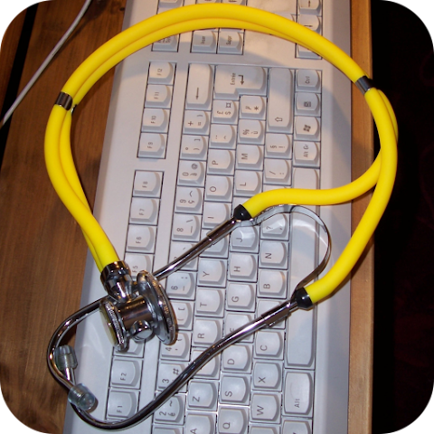

### Opioconvert {#opioconvert .outil-heading}
```{=html}
<div class="outil">
<div class="outil-header">
<a href="https://opioconvert.fr/" class="outil-logo" target="_blank">

</a>
<div class="outil-meta">
<a href="https://opioconvert.fr/" class="outil-nom" target="_blank">Opioconvert</a>
<div class="outil-source">
À compléter
<br><span style="color: #006B3D;">Gratuit sans inscription</span>
</div>
</div>
</div>
<p class="outil-description">À compléter.</p>
<details class="outil-details">
<summary>Détails</summary>
<div class="outil-details-content">À compléter.</div>
</details>
</div>
```

### MDCalc {#mdcalc .outil-heading}
```{=html}
<div class="outil">
<div class="outil-header">
<a href="https://www.mdcalc.com/" class="outil-logo" target="_blank">

</a>
<div class="outil-meta">
<a href="https://www.mdcalc.com/" class="outil-nom" target="_blank">MDCalc</a>
<div class="outil-source">
MDCalc
<br><span style="color: #006B3D;">Gratuit sans inscription</span>
</div>
</div>
</div>
<p class="outil-description">À compléter.</p>
<details class="outil-details">
<summary>Détails</summary>
<div class="outil-details-content">À compléter.</div>
</details>
</div>
```

### Medicalcul {#medicalcul .outil-heading}
```{=html}
<div class="outil">
<div class="outil-header">
<a href="http://medicalcul.free.fr/_indexalpha.html" class="outil-logo" target="_blank">

</a>
<div class="outil-meta">
<a href="http://medicalcul.free.fr/_indexalpha.html" class="outil-nom" target="_blank">Medicalcul</a>
<div class="outil-source">
Dr. Philippe Mignard (GHEF)
<br><span class="outil-access gratuit">Gratuit sans inscription</span>
</div>
</div>
</div>
<p class="outil-description">À compléter.</p>
<details class="outil-details">
<summary>Détails</summary>
<div class="outil-details-content">À compléter.</div>
</details>
</div>
```

### Calculate by QxMD {#qxmd .outil-heading}
```{=html}
<div class="outil">
<div class="outil-header">
<a href="https://qxmd.com/calculate" class="outil-logo" target="_blank">

</a>
<div class="outil-meta">
<a href="https://qxmd.com/calculate" class="outil-nom" target="_blank">QxMD</a>
<div class="outil-source">
??
<br><span class="outil-access gratuit">Gratuit sans inscription</span>
</div>
</div>
</div>
<p class="outil-description">À compléter.</p>
<details class="outil-details">
<summary>Détails</summary>
<div class="outil-details-content">À compléter.</div>
</details>
</div>
```

### Compendium CH {#compendiumch .outil-heading}
```{=html}
<div class="outil">
<div class="outil-header">
<a href="https://www.compendium.ch/" class="outil-logo" target="_blank">

</a>
<div class="outil-meta">
<a href="https://www.compendium.ch/" class="outil-nom" target="_blank">Compendium Suisse des Médicaments</a>
<div class="outil-source">
HCI Solutions AG
<br><span style="color: #006B3D;">Gratuit sans inscription</span>
</div>
</div>
</div>
<p class="outil-description">À compléter.</p>
<details class="outil-details">
<summary>Détails</summary>
<div class="outil-details-content">À compléter.</div>
</details>
</div>
```

### Psychiatrienet {#psychiatrienet .outil-heading}
```{=html}
<div class="outil">
<div class="outil-header">
<a href="https://www.psychiatrienet.nl/" class="outil-logo" target="_blank">

</a>
<div class="outil-meta">
<a href="https://www.psychiatrienet.nl/" class="outil-nom" target="_blank">Psychiatrienet</a>
<div class="outil-source">
À compléter
<br><span style="color: #006B3D;">Gratuit sans inscription</span>
</div>
</div>
</div>
<p class="outil-description">À compléter.</p>
<details class="outil-details">
<summary>Détails</summary>
<div class="outil-details-content">À compléter.</div>
</details>
</div>
```

### Psychopharma {#psychopharma .outil-heading}
```{=html}
<div class="outil">
<div class="outil-header">
<a href="https://www.psychopharma.fr/" class="outil-logo" target="_blank">

</a>
<div class="outil-meta">
<a href="https://www.psychopharma.fr/" class="outil-nom" target="_blank">Psychopharma</a>
<div class="outil-source">
À compléter
<br><span style="color: #006B3D;">Gratuit sans inscription</span>
</div>
</div>
</div>
<p class="outil-description">À compléter.</p>
<details class="outil-details">
<summary>Détails</summary>
<div class="outil-details-content">À compléter.</div>
</details>
</div>
```


### Collège Méditerranéen de Psychiatrie {#cmpsy .outil-heading}
```{=html}
<div class="outil">
<div class="outil-header">
<a href="http://cmpsy-switch.com/Accueil/" class="outil-logo" target="_blank">

</a>
<div class="outil-meta">
<a href="http://cmpsy-switch.com/Accueil/" class="outil-nom" target="_blank">Collège Méditerranéen de Psychiatrie</a>
<div class="outil-source">
À compléter
<br><span style="color: #006B3D;">Gratuit sans inscription</span>
</div>
</div>
</div>
<p class="outil-description">À compléter.</p>
<details class="outil-details">
<summary>Détails</summary>
<div class="outil-details-content">À compléter.</div>
</details>
</div>
```