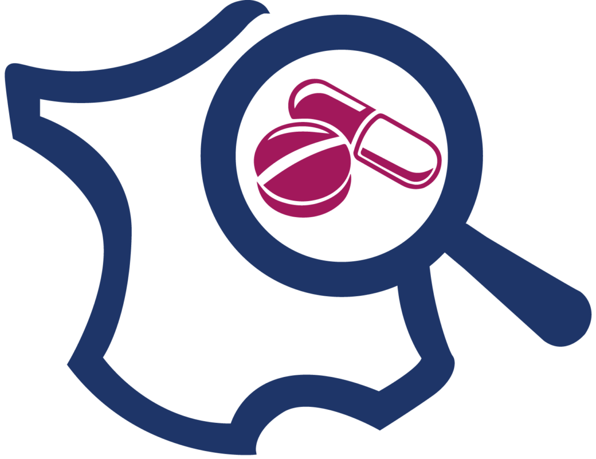

### LactMed {#lactmed .outil-heading}

```{=html}
<div class="outil">
<div class="outil-header">
<a href="https://www.ncbi.nlm.nih.gov/books/NBK501922/" class="outil-logo" target="_blank">

</a>
<div class="outil-meta">
<a href="https://www.ncbi.nlm.nih.gov/books/NBK501922/" class="outil-nom" target="_blank">LactMed</a>
<div class="outil-source">
National Library of Medicine (NLM)
<br><span class="outil-access gratuit">Gratuit sans inscription</span>
</div>
</div>
</div>
<p class="outil-description">À compléter.</p>
<details class="outil-details">
<summary>Détails</summary>
<div class="outil-details-content">À compléter.</div>
</details>
</div>
```


### e-lactancia {#elactancia .outil-heading}

```{=html}
<div class="outil">
<div class="outil-header">
<a href="https://www.e-lactancia.org/" class="outil-logo" target="_blank">

</a>
<div class="outil-meta">
<a href="https://www.e-lactancia.org/" class="outil-nom" target="_blank">e-lactancia</a>
<div class="outil-source">
APILAM (Association pour la promotion et le soutien culturel de l'allaitement maternel)
<br><span class="outil-access gratuit">Gratuit sans inscription</span>
</div>
</div>
</div>
<p class="outil-description">À compléter.</p>
<details class="outil-details">
<summary>Détails</summary>
<div class="outil-details-content">À compléter.</div>
</details>
</div>
```

### CRAT {#crat .outil-heading}

```{=html}
<div class="outil">
<div class="outil-header">
<a href="https://www.lecrat.fr/" class="outil-logo" target="_blank">

</a>
<div class="outil-meta">
<a href="https://www.lecrat.fr/" class="outil-nom" target="_blank">CRAT — Centre de Référence sur les Agents Tératogènes</a>
<div class="outil-source">
AP-HP / Sorbonne Université
<br><span class="outil-access gratuit">Gratuit sans inscription</span>
</div>
</div>
</div>
<p class="outil-description">À compléter.</p>
<details class="outil-details">
<summary>Détails</summary>
<div class="outil-details-content">À compléter.</div>
</details>
</div>
```

### metaPreg {#metapreg .outil-heading}

```{=html}
<div class="outil">
<div class="outil-header">
<a href="http://metapreg.org/" class="outil-logo" target="_blank">

</a>
<div class="outil-meta">
<a href="http://metapreg.org/" class="outil-nom" target="_blank">metPreg</a>
<div class="outil-source">
ANSM - HCL
<br><span class="outil-access gratuit">Gratuit sans inscription</span>
</div>
</div>
</div>
<p class="outil-description">À compléter.</p>
<details class="outil-details">
<summary>Détails</summary>
<div class="outil-details-content">À compléter.</div>
</details>
</div>
```

### LiverTox {#livertox .outil-heading}

```{=html}
<div class="outil">
<div class="outil-header">
<a href="https://www.ncbi.nlm.nih.gov/books/NBK547852/" class="outil-logo" target="_blank">

</a>
<div class="outil-meta">
<a href="https://www.ncbi.nlm.nih.gov/books/NBK547852/" class="outil-nom" target="_blank">LiverTox</a>
<div class="outil-source">
National Institute of Diabetes and Digestive and Kidney Diseases (NIDDK) / NLM
<br><span class="outil-access gratuit">Gratuit sans inscription</span>
</div>
</div>
</div>
<p class="outil-description">À compléter.</p>
<details class="outil-details">
<summary>Détails</summary>
<div class="outil-details-content">À compléter.</div>
</details>
</div>
```


### Pneumotox {#pneumotox  .outil-heading}

```{=html}
<div class="outil">
<div class="outil-header">
<a href="https://www.pneumotox.com/" class="outil-logo" target="_blank">

</a>
<div class="outil-meta">
<a href="https://www.pneumotox.com/" class="outil-nom" target="_blank">Pneumotox</a>
<div class="outil-source">
Groupe Pneumotox
<br><span class="outil-access gratuit">Gratuit sans inscription</span>
</div>
</div>
</div>
<p class="outil-description">À compléter.</p>
<details class="outil-details">
<summary>Détails</summary>
<div class="outil-details-content">À compléter.</div>
</details>
</div>
```


### Credible Meds {#credible-meds  .outil-heading}

```{=html}
<div class="outil">
<div class="outil-header">
<a href="https://www.crediblemeds.org/" class="outil-logo" target="_blank">

</a>
<div class="outil-meta">
<a href="https://www.crediblemeds.org/" class="outil-nom" target="_blank">Credible Meds — QTDrugs List</a>
<div class="outil-source">
Arizona CERT / University of Arizona
<br><span class="outil-access gratuit">Gratuit sans inscription</span>
</div>
</div>
</div>
<p class="outil-description">À compléter.</p>
<details class="outil-details">
<summary>Détails</summary>
<div class="outil-details-content">À compléter.</div>
</details>
</div>
```

### Réseau Français des CRPV {#rfcrpv  .outil-heading}

```{=html}
<div class="outil" id="rfcrpv">
<div class="outil-header">
<a href="https://www.rfcrpv.fr/" class="outil-logo" target="_blank">

</a>
<div class="outil-meta">
<a href="https://www.rfcrpv.fr/" class="outil-nom" target="_blank">Réseaux Français des CRPV</a>
<div class="outil-source">
-
<br><span class="outil-access gratuit">Gratuit sans inscription</span>
</div>
</div>
</div>
<p class="outil-description">À compléter.</p>
<details class="outil-details">
<summary>Détails</summary>
<div class="outil-details-content">À compléter.</div>
</details>
</div>
```